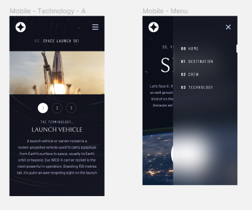
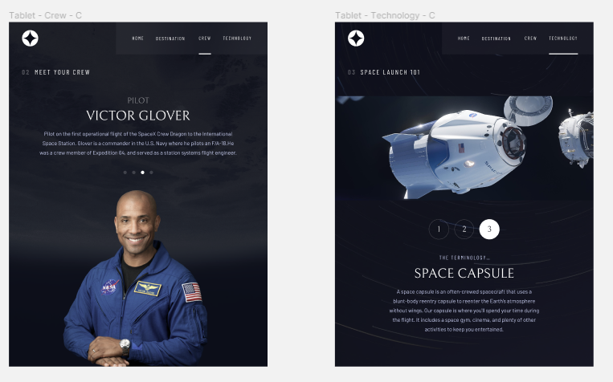
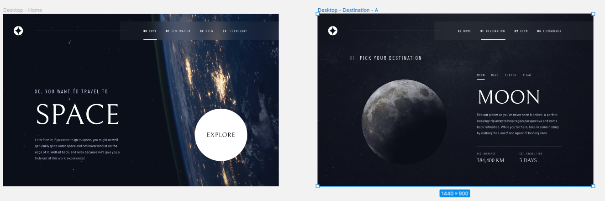
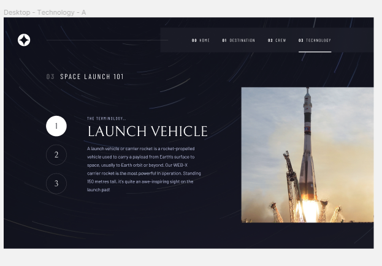

# Frontend Mentor - Space tourism website challenge

## Welcome! 👋
the website url : https://ali-khaled-13.github.io/space-tourism/
## The challenge

Users should be able to:

- View the optimal layout for each of the website's pages depending on their device's screen size
- See hover states for all interactive elements on the page
- View each page and be able to toggle between the tabs to see new information
- extra point: mobile users should be able to swipe through the carousel

the challenge is to build out this multi-page space tourism website and get it looking as close to the design as possible.
choosing to use a JS-heavy approach, I used a local `data.json` configuration file for the pages data and switching realms. 

## technologies used
- React
- DOM manipulation with plain JS (for mobile swiping and carousel capability)
- Semantic HTML5 markup
- Flexbox
- CSS Grid
- Mobile-first workflow
- [Styled Components](https://styled-components.com/) - For styles

this project is built using Vite, not create-react-app.

### design Screenshots
## Mobile

## Tablet

## Desktop

